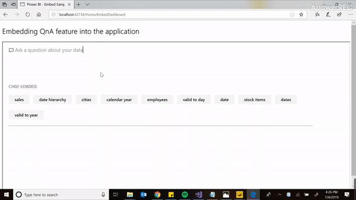
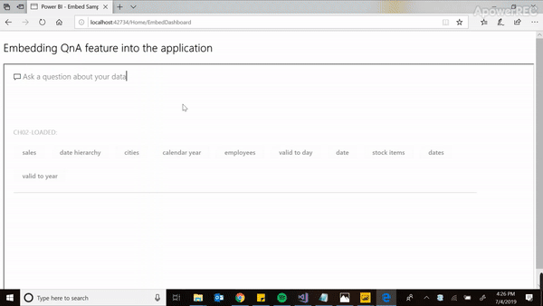
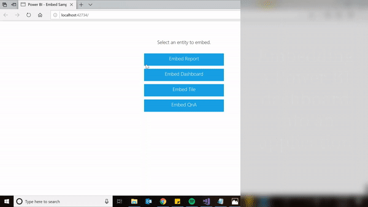

# Power-BI-embedded
Harnessing the power of Power BI embedded using its QnA feature


[](http://hits.dwyl.io/ashish1993utd/Embedding-Power-BI-into-Mobile-Application)

### Built an application that embeds the services from POWER BI into the user app. It can be used over mobile and desktop, and a user can embed a dashboard from Power BI service into this application and also use its QnA feature to get answers to questions using Natural Language.

## Demo

## 

##

##
[](https://www.youtube.com/watch?v=CpbcTSYROik)

**The entire demo of the project can be found on [YouTube](https://www.youtube.com/watch?v=CpbcTSYROik) and [Youtube-Speech to text Mobile Application demo](https://www.youtube.com/watch?v=Afw9cN5ujS8).**

## Technologies and Tools
* Power BI 
* JavaScript
* .NET
* HTML
 
## Code Examples

````
namespace PowerBIEmbedded_AppOwnsData.Controllers
{
    public class HomeController : Controller
    {
        private readonly IEmbedService m_embedService;

        public HomeController()
        {
            m_embedService = new EmbedService();
        }

        public ActionResult Index()
        {
            var result = new IndexConfig();
            var assembly = Assembly.GetExecutingAssembly().GetReferencedAssemblies().Where(n => n.Name.Equals("Microsoft.PowerBI.Api")).FirstOrDefault();
            if (assembly != null)
            {
                result.DotNETSDK = assembly.Version.ToString(3);
            }
            return View(result);
        }

        public async Task<ActionResult> EmbedReport(string username, string roles)
        {
            var embedResult = await m_embedService.EmbedReport(username, roles);
            if (embedResult)
            {
                return View(m_embedService.EmbedConfig);
            }
            else
            {
                return View(m_embedService.EmbedConfig);
            }
        }

        public async Task<ActionResult> EmbedDashboard()
        {
            var embedResult = await m_embedService.EmbedDashboard();
            if (embedResult)
            {
                return View(m_embedService.EmbedConfig);
            }
            else
            {
                return View(m_embedService.EmbedConfig);
            }
        }

        public async Task<ActionResult> EmbedTile()
        {
            var embedResult = await m_embedService.EmbedTile();
            if (embedResult)
            {
                return View(m_embedService.TileEmbedConfig);
            }
            else
            {
                return View(m_embedService.TileEmbedConfig);
            }
        }
    }
}

````
````
   var datasets = await client.Datasets.GetDatasetByIdInGroupAsync(WorkspaceId, report.DatasetId);
                    m_embedConfig.IsEffectiveIdentityRequired = datasets.IsEffectiveIdentityRequired;
                    m_embedConfig.IsEffectiveIdentityRolesRequired = datasets.IsEffectiveIdentityRolesRequired;
                    GenerateTokenRequest generateTokenRequestParameters;
                    // This is how you create embed token with effective identities
                    if (!string.IsNullOrWhiteSpace(username))
                    {
                        var rls = new EffectiveIdentity(username, new List<string> { report.DatasetId });
                        if (!string.IsNullOrWhiteSpace(roles))
                        {
                            var rolesList = new List<string>();
                            rolesList.AddRange(roles.Split(','));
                            rls.Roles = rolesList;
                        }
                        // Generate Embed Token with effective identities.
                        generateTokenRequestParameters = new GenerateTokenRequest(accessLevel: "view", identities: new List<EffectiveIdentity> { rls });
                    }
                    else
                    {
                        // Generate Embed Token for reports without effective identities.
                        generateTokenRequestParameters = new GenerateTokenRequest(accessLevel: "view");
                    }

````

## Status
Project is: _finished_.  

## Contact
If you loved what you read here and feel like we can collaborate to produce some exciting stuff, or if you
just want to shoot a question, please feel free to connect with me on 
<a href="mailto: hello@sharma-ashish.com">email</a> or 
<a href="https://www.linkedin.com/in/ashishsharma1993/" target="_blank">LinkedIn</a>
